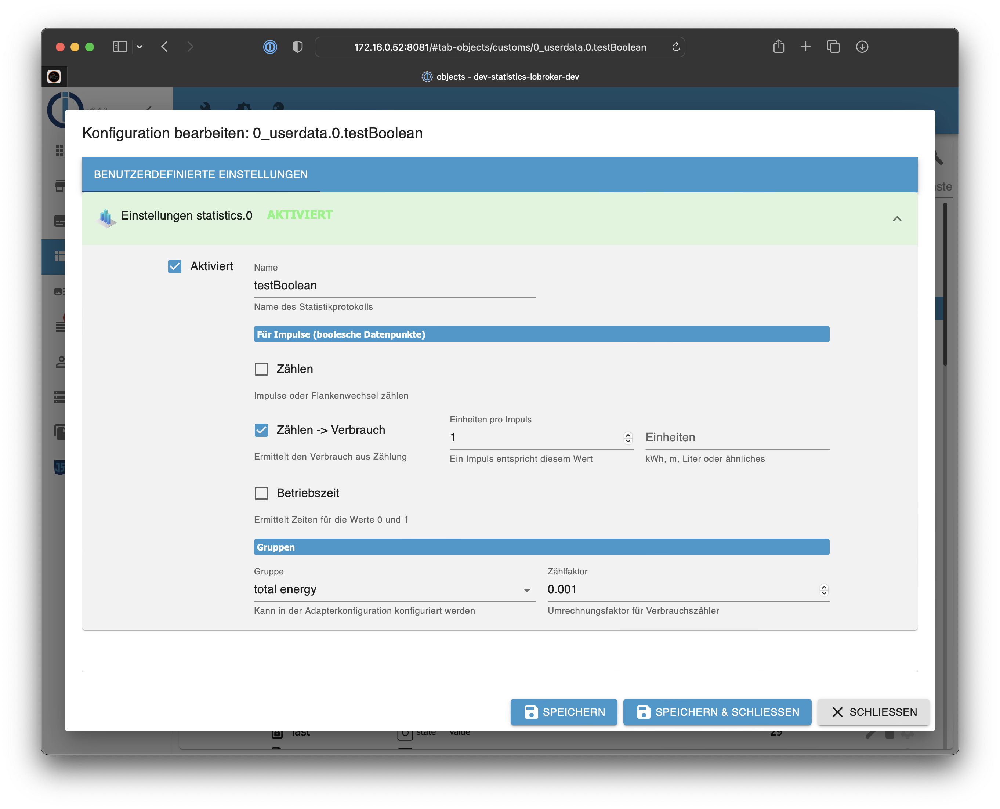
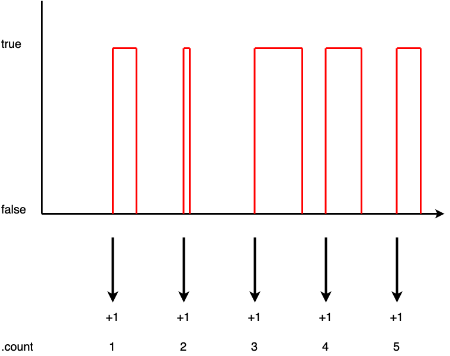

# ioBroker.statistics

Der Adapter speichert für jedes aktive Objekt die Werte temporär in ``statistics.x.temp`` für die fortlaufende Bewertung.

Zu vorgegebenen Zeiten (Tag, Woche, Monat, Quartal, Jahr) erfolgt die Übernahme der temporären Werte in die Struktur ``statistics.x.save``.

Je nach Datentyp des Datenpunktes (``boolean`` oder ``number``) werden unterschiedliche Optionen angeboten.

Für bestimmte Werte werden auch 5min Zwischenwerte ermittelt, wie es z.B. bei den 433MHz Steckdosen von ELV der Fall ist, die einen Verbrauchswert alle 5min übermitteln.

**Der Adapter reagiert nur auf bestätigte Werte (state.ack = true), nicht auf Befehle (steuere)!**

## Boolean Zustände



### Zählen

Speichert Werte in ``statistics.x.temp.count.*`` bzw. ``statistics.x.save.count.*``.

Stellt das binäre Objekt eine Impulsfolge dar, die z.B. aus Zählerimpulsen entsteht, so ist hier das Prinzip dargestellt:

Der Adapter zählt die Impulse und es wird mit einer Zählerkonstanten multipliziert.

So ergibt sich aus den 0/1-Wechseln eine analoge Größe, die auch dann im Adapter sofort weiter benutzt werden kann (z.B. für Summendelta).

Die sich ergebende Analoggröße ist eine stetig steigende.



### Zählen -> Verbrauch

Speichert Werte in ``statistics.x.temp.sumCount.*`` bzw. ``statistics.x.save.sumCount.*``.


### Betriebszeit

Speichert Werte in ``statistics.x.temp.timeCount.*`` bzw. ``statistics.0.save.timeCount.*``.


## Number Zustände


## Analogwerte

Grundsätzlich wir das Minimum Maximum und der Durchschnitt ermittelt.
Der Durchschnitt ist der arithmetische Mittelwert.

Für einen fortlaufenden Verbrauchswert wie er bei der Energiezählung entsteht kann man eine Delta ermitteln um die Verbräuche je Zeiteinheit darzustellen. 
Dies kann auch auf Verbräuche angewendet werden, die aus Impulszählung entstehen.


## Optionen

| Attribute         | Type    | State-Type |
|-------------------|---------|------------|
| enabled           | boolean | -          |
| count             | boolean | boolean    |
| fiveMin           | boolean | boolean    |
| sumCount          | boolean | boolean    |
| impUnitPerImpulse | number  | boolean    |
| impUnit           | string  | boolean    |
| timeCount         | boolean | boolean    |
| avg               | boolean | number     |
| minmax            | boolean | number     |
| sumDelta          | boolean | number     |
| sumIgnoreMinus    | boolean | number     |
| groupFactor       | number  | boolean    |
| logName           | string  | -          |
| sumGroup          | string  | -          |

```json
"custom": {
    "statistics.0": {
        "enabled": true,
        "count": false,
        "fiveMin": false,
        "sumCount": false,
        "impUnitPerImpulse": 1,
        "impUnit": "",
        "timeCount": false,
        "avg": true,
        "minmax": true,
        "sumDelta": true,
        "sumIgnoreMinus": true,
        "groupFactor": 2,
        "logName": "mynumber",
        "sumGroup": "energy"
    }
}
```

## sendTo

```javascript
sendTo('statistics.0', 'enableStatistics', {
    id: '0_userdata.0.manual'
}, (data) => {
    if (data.success) {
        console.log(`Added statistics`);
    } else {
        console.error(data.err);
    }
});
```

```javascript
sendTo('statistics.0', 'enableStatistics', {
    id: '0_userdata.0.mynumber',
    options: {
        avg: true,
        minmax: true,
        sumDelta: true,
        sumIgnoreMinus: true
    }
}, (data) => {
    if (data.success) {
        console.log(`Added statistics`);
    } else {
        console.error(data.err);
    }
});
```
